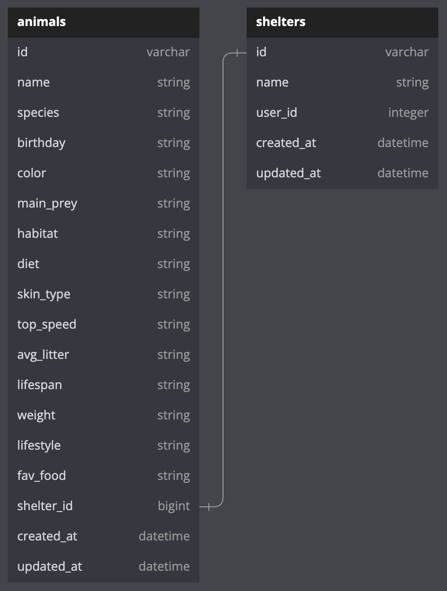

# How to make Chicken Tracker Service
### Schema


### Required gems
```ruby
gem 'faraday'
```

### At top of Service
```ruby
def conn
  Faraday.new(url: "https://hidden-sands-71693-380133048218.herokuapp.com") do |faraday|
    faraday.adapter Faraday.default_adapter # Ensure you have this line to set the adapter
  end
end
```

# Shelters
### Show one Shelter
```ruby
response = conn.get("/api/v1/shelters/<SHELTER_ID>") do |req|
  req.headers['Content-Type'] = 'application/json'
end
JSON.parse(response.body, symbolize_names: true)
```
Returns
```ruby
{
    "data": {
        "id": "1",
        "type": "shelter",
        "attributes": {
            "name": "Red Barn",
            "user_id": 1
        },
        "relationships": {
            "animals": {
                "data": []
            }
        }
    }
}
```
### Index User's Shelters
```ruby
response = conn.get("/api/v1/shelters?user_id=<USER_ID>") do |req|
  req.headers['Content-Type'] = 'application/json'
end
JSON.parse(response.body, symbolize_names: true)
```
Returns
```ruby
{
    "data": [
        {
            "id": "1",
            "type": "shelter",
            "attributes": {
                "name": "Red Barn",
                "user_id": 1
            },
            "relationships": {
                "animals": {
                    "data": []
                }
            }
        },
        {
            "id": "2",
            "type": "shelter",
            "attributes": {
                "name": "Blue Coop",
                "user_id": 1
            },
            "relationships": {
                "animals": {
                    "data": []
                }
            }
        }
    ]
}
```
### Create Shelter
```ruby
response = conn.post("/api/v1/shelters") do |req|
  req.headers['Content-Type'] = 'application/json'
  req.body = {"shelter": {"name": "<SHELTER_NAME>", "user_id": "<USER_ID>"}}
end
JSON.parse(response.body, symbolize_names: true)
```
Returns
```ruby
{
    "data": {
        "id": "3",
        "type": "shelter",
        "attributes": {
            "name": "Green Sea",
            "user_id": 1
        },
        "relationships": {
            "animals": {
                "data": []
            }
        }
    }
}
```
### Update Shelter
```ruby
response = conn.patch("/api/v1/shelters/<SHELTER_ID>") do |req|
  req.headers['Content-Type'] = 'application/json'
  req.body = {"shelter": {"name": "<SHELTER_NAME>", "user_id": "<USER_ID>"}}
end
```
Returns nothing
### Delete Shelter
```ruby
response = conn.delete("/api/v1/shelters/<SHELTER_ID>") do |req|
  req.headers['Content-Type'] = 'application/json'
end
```
Returns nothing
# Animals
### Show one Animal
```ruby
response = conn.get("/api/v1/shelters/<SHELTER_ID>/animals/<ANIMALS_ID>") do |req|
  req.headers['Content-Type'] = 'application/json'
end
JSON.parse(response.body, symbolize_names: true)
```
Returns
```ruby
{
    "data": {
        "id": "1",
        "type": "animal",
        "attributes": {
            "shelter_id": 1,
            "name": "Chuck",
            "species": "Chicken",
            "birthday": "Jan 1",
            "color": "Red",
            "main_prey": "Worms",
            "habitat": "Backyard",
            "diet": "Corn",
            "skin_type": "Feathers",
            "top_speed": "1337 mph",
            "avg_litter": "12",
            "lifespan": "1-2 years",
            "weight": "5 lbs",
            "lifestyle": "Fat and lazy",
            "fav_food": "Fear"
        },
        "relationships": {
            "shelter": {
                "data": {
                    "id": "1",
                    "type": "shelter"
                }
            }
        }
    }
}
```
### Index Shelter's Animals
```ruby
response = conn.get("/api/v1/shelters/<SHELTER_ID>/<ANIMALS_ID>") do |req|
  req.headers['Content-Type'] = 'application/json'
end
JSON.parse(response.body, symbolize_names: true)
```
Returns
```ruby
{
    "data": [
        {
            "id": "1",
            "type": "animal",
            "attributes": {
                "shelter_id": 1,
                "name": "Chuck",
                "species": "Chicken",
                "birthday": "Jan 1",
                "color": "Red",
                "main_prey": "Worms",
                "habitat": "Backyard",
                "diet": "Corn",
                "skin_type": "Feathers",
                "top_speed": "1337 mph",
                "avg_litter": "12",
                "lifespan": "1-2 years",
                "weight": "5 lbs",
                "lifestyle": "Fat and lazy",
                "fav_food": "Fear"
            },
            "relationships": {
                "shelter": {
                    "data": {
                        "id": "1",
                        "type": "shelter"
                    }
                }
            }
        },
        {
            "id": "2",
            "type": "animal",
            "attributes": {
                "shelter_id": 1,
                "name": "Todd",
                "species": "Chicken",
                "birthday": null,
                "color": null,
                "main_prey": "Seeds, Fruit, Insects, Berries",
                "habitat": "Open woodland and sheltered grassland",
                "diet": "Omnivore",
                "skin_type": "Feathers",
                "top_speed": "6 mph",
                "avg_litter": "2",
                "lifespan": "2 - 4 years",
                "weight": "1kg - 3kg (2.2lbs - 6.6lbs)",
                "lifestyle": "Flock",
                "fav_food": "Seeds"
            },
            "relationships": {
                "shelter": {
                    "data": {
                        "id": "1",
                        "type": "shelter"
                    }
                }
            }
        }
    ]
}
```
### Create Animal
```ruby
response = conn.post("/api/v1/shelters/<SHELTER_ID>/animals") do |req|
  req.headers['Content-Type'] = 'application/json'
  req.body = {"animal": {"shelter_id": "<ANIMAL_SHELTER_ID>", "name": "<ANIMAL_NAME>", "species": "<ANIMAL_SPECIES>"}}
end
JSON.parse(response.body, symbolize_names: true)
```
Returns
```ruby
{
    "data": {
        "id": "1",
        "type": "animal",
        "attributes": {
            "shelter_id": 1,
            "name": "Huck",
            "species": "Chicken",
            "birthday": null,
            "color": null,
            "main_prey": "Seeds, Fruit, Insects, Berries",
            "habitat": "Open woodland and sheltered grassland",
            "diet": "Omnivore",
            "skin_type": "Feathers",
            "top_speed": "6 mph",
            "avg_litter": "2",
            "lifespan": "2 - 4 years",
            "weight": "1kg - 3kg (2.2lbs - 6.6lbs)",
            "lifestyle": "Flock",
            "fav_food": "Seeds"
        },
        "relationships": {
            "shelter": {
                "data": {
                    "id": "1",
                    "type": "shelter"
                }
            }
        }
    }
}
```
### Update Animal
```ruby
response = conn.patch("/api/v1/shelters/<SHELTER_ID>/animals/<ANIMALS_ID>") do |req|
  req.headers['Content-Type'] = 'application/json'
  req.body = {"animal": {"name": "<ANIMAL_NAME>", "species": "<ANIMAL_SPECIES>", "birthday": "<ANIMAL_BIRTHDAY>", "color": "<ANIMAL_COLOR>", "main_prey": "<ANIMAL_MAIN_PREY>", "habitat": "<ANIMAL_HABITAT>", "diet": "<ANIMAL_DIET>", "skin_type": "<ANIMAL_SKIN_TYPE>", "top_speed": "<ANIMAL_TOP_SPEED>", "avg_litter": "<ANIMAL_AVG_LITTER>", "lifespan": "<ANIMAL_LIFESPAN>", "weight": "<ANIMAL_WEIGHT>", "lifestyle": "<ANIMAL_LIFESTYLE>", "fav_food": "<ANIMAL_FAV_FOOD>", "shelter_id": "<ANIMAL_SHELTER_ID>"}}
end
JSON.parse(response.body, symbolize_names: true)
```
Returns
```ruby
{
    "data": {
        "id": "1",
        "type": "animal",
        "attributes": {
            "shelter_id": 1,
            "name": "Chuck",
            "species": "Chicken",
            "birthday": "Jan 1",
            "color": "Red",
            "main_prey": "Worms",
            "habitat": "Backyard",
            "diet": "Corn",
            "skin_type": "Feathers",
            "top_speed": "1337 mph",
            "avg_litter": "12",
            "lifespan": "1-2 years",
            "weight": "5 lbs",
            "lifestyle": "Fat and lazy",
            "fav_food": "Fear"
        },
        "relationships": {
            "shelter": {
                "data": {
                    "id": "1",
                    "type": "shelter"
                }
            }
        }
    }
}
```
NOTE: not all attributes required to Update

### Delete Animal
```ruby
response = conn.delete("/api/v1/shelters/<SHELTER_ID>/animals/<ANIMALS_ID>") do |req|
  req.headers['Content-Type'] = 'application/json'
end
```
Returns nothing
